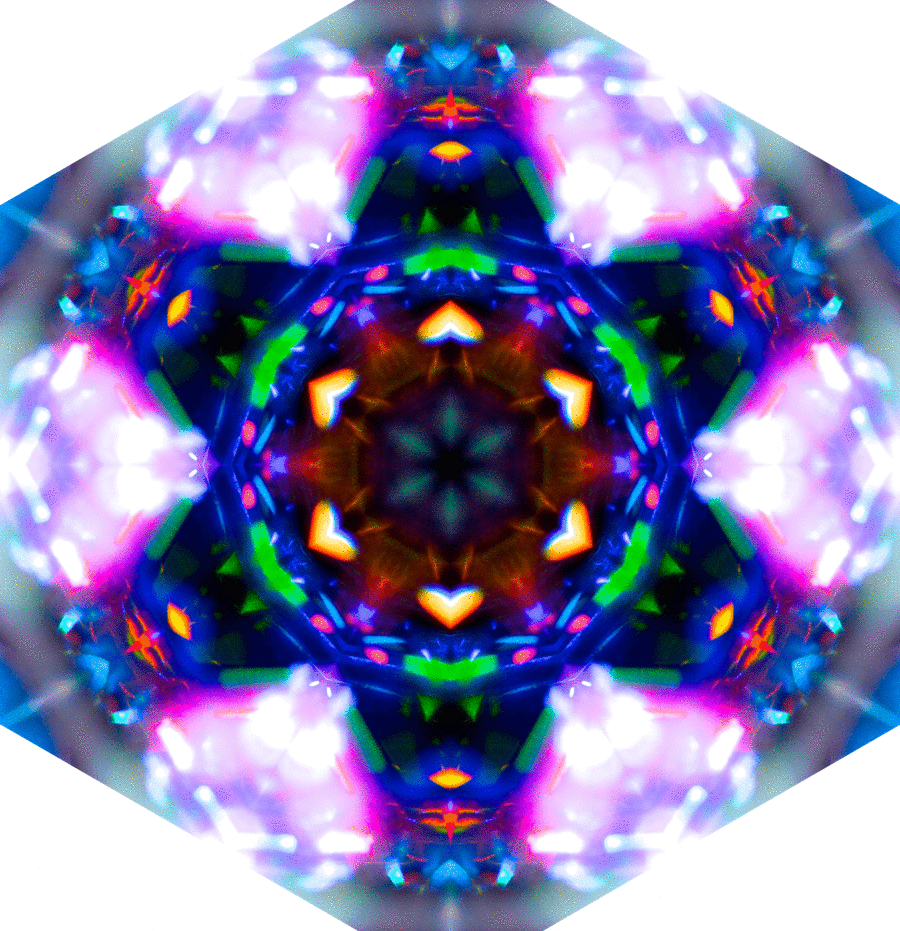

# The Crystal Game!

The crystal game is the worl'd first and possibly onlyiest game that I'm currently discussing. 

Your job is to use the number values of the crystals to match your target number. The target number and the crystal values are random and will be different each round. 

The crystal game is for all ages, although an infant may find it more difficult to conseptualize at first.

Crystal game's goal is to see the world shine, whatever that means. 

To start click a cystal and see what number it gives you! The rest is up to fate.

If you need any assistance or just have general questions please contact Bachs at AP Incorporated, 1735 Market St. Ste A69 Philadelphia, PA 19103

https://apino117.github.io/The-Crystal-Game/

 

